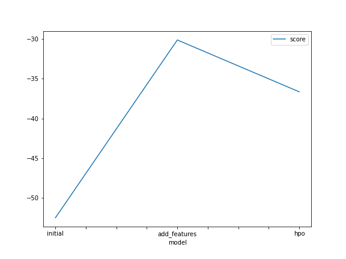
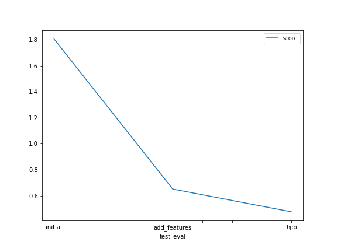

# Report: Predict Bike Sharing Demand with AutoGluon Solution
#### Khoa Pham

## Initial Training
### What did you realize when you tried to submit your predictions? What changes were needed to the output of the predictor to submit your results?
The submission has to be used the submission csv and replace the 'count' column with the prediction of each model output. The Kaggle needs all prediction to be positive; therefore, every output prediciton needed to be chekced of negative values and replaced them by zero. However, all 3 models output has none zero value.

### What was the top ranked model that performed?
After 3 times running with initial model, more features model and hyperparameter tuning, the WeightedEnsemble_L3 model always get the best evaluation. 

## Exploratory data analysis and feature creation
### What did the exploratory analysis find and how did you add additional features?
Plot all numerical histogram all each features and based on these histogram of each features and starting enrich more features based on windspeed, and temperature. And I try to plot the correlation matrix of all features. Based on the datetime column, I also extract more features by getting 4 more columns: year, month, hour, day. And also add the rush_hour categorical column based on time frame. 
### How much better did your model preform after adding additional features and why do you think that is?
With extra enriched features, the model acquires such a increase in scoring from 1.806 to 0.651 in kaggle score (the lower the better). Because the additional features will help the model get more information to learn from and can extract the better pattern within the dataset that leads into better predictions. Importantly, the features that are highly correlated with target variables in this case is ‘count’. 

## Hyper parameter tuning
### How much better did your model preform after trying different hyper parameters?
The score after adding more hyper params improve the kaggle public score from 0.651 to 0.476. Certainly, the hyper param tuning give an extra boost to the accuracy of the model prediction.

### If you were given more time with this dataset, where do you think you would spend more time?
Enriching more helpful features from the dataset and also give an extra fine tunning the hyper params to get the best out of the prediciton as possbible. 

### Create a table with the models you ran, the hyperparameters modified, and the kaggle score.
|model|num_epoch|time|num_boost_round|score|
|--|--|--|--|--|
|initial|default|600|default|1.806|
|add_features|default|600|default|0.651|
|hpo|10|600|100|0.476|

### Create a line plot showing the top model score for the three (or more) training runs during the project.

TODO: Replace the image below with your own.

### Create a line plot showing the top kaggle score for the three (or more) prediction submissions during the project.

TODO: Replace the image below with your own.

## Summary
In this project, we utilize the AutoGluon library to train several models for the Bike Sharing Demand competition in Kaggle. We try to predict the count usage of bikes and compare the scoring model by Kaggle submission scoring. There are 3 approaches on this project:
- Draw dataset and use the default setting on models and fit into "Tabular Prediction" but this score the worst out of three. 
- With adding more features by enrich those currents one from the dataset and fit into AutoGluon Tabular Prediciton, the model is getting improve a better score than the intial approach.
- By using the hyperparameter tuning, the model gets the extra boost on scores compared to other preivous model. 

In conclusion, as trying the prediction on regression model like this, we should try to add more features from the raw dataset which are correlated to the label variable and go deeper into the hyperparameter changing in order to get the better prediction. 

